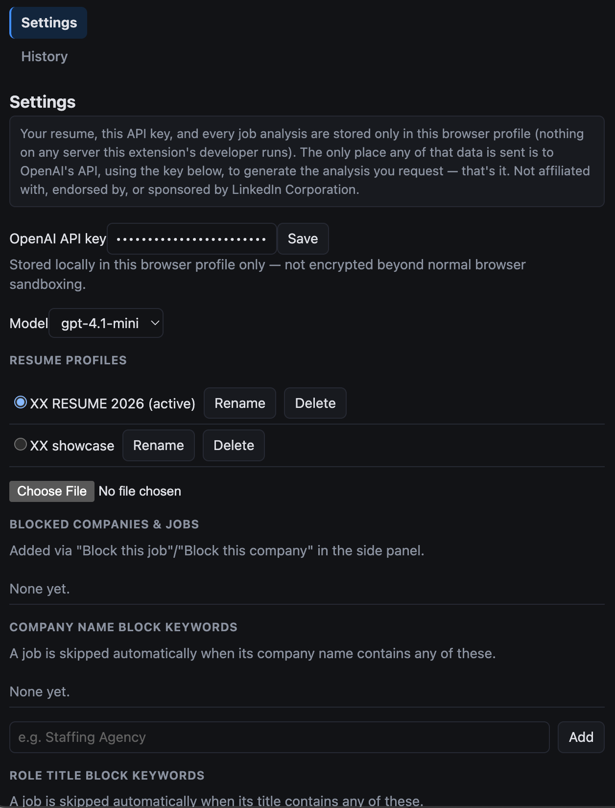
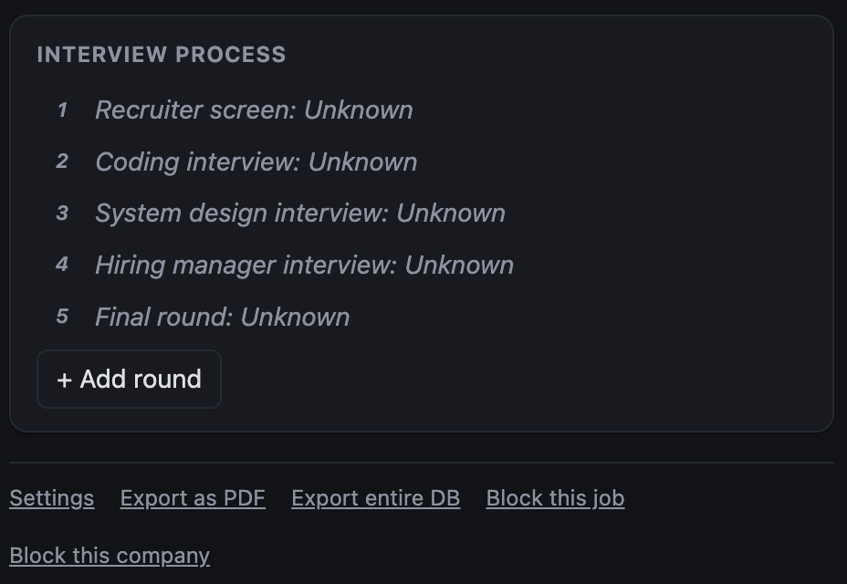

# linkedin-jd-intelligence

> 🤖 This repo is built with AI-assisted coding (Claude Code).

Chrome browser extension: Smart LinkedIn JD intelligence.

Not affiliated with, endorsed by, or sponsored by LinkedIn Corporation.

Full design (architecture, diagrams, data model, algorithms) lives in
[`docs/DESIGN.md`](docs/DESIGN.md). For a guided tour of the code — the file layout and how a click
on "Analyze" actually flows end to end — see [`src/README.md`](src/README.md).

## Privacy

Everything this extension touches — your OpenAI API key, resume text, and every job analysis — is
stored **only in your own browser profile** (`chrome.storage.local` / IndexedDB). Nothing is ever
sent to, or readable by, any server this extension's developer runs — there is no backend.

The **only** network call it ever makes is a direct request from your browser to OpenAI's API, using
the key you provide, to generate the analysis you explicitly ask for by clicking Analyze. Since
every call is authenticated with your own key, every one of them is traceable in your own OpenAI
account's usage dashboard — nothing routes through, or is logged by, anyone else.

```
 Your browser
 ┌──────────────────────────────────────────────────┐
 │ chrome.storage.local / IndexedDB                 │
 │   ▲ read/write only — stays right here           │
 │   │                                              │
 │ Side panel ──"Analyze" click──▶ fetch()          │
 └────────────────────────────────┬─────────────────┘
                                  │  HTTPS, authenticated with YOUR OpenAI API key
                                  ▼
                           api.openai.com
                  (every request is traceable in YOUR OWN OpenAI usage dashboard)
```

Full details, including exactly what's collected and why: [`PRIVACY.md`](PRIVACY.md).

## Build & load

```
npm install
npm run build      # tsc --noEmit && vite build -> dist/
```

Then `chrome://extensions` → Developer mode → "Load unpacked" → select `dist/`.

## Screenshots

| Skill / experience match | Settings — resumes, model, block list |
|---|---|
|  |  |


