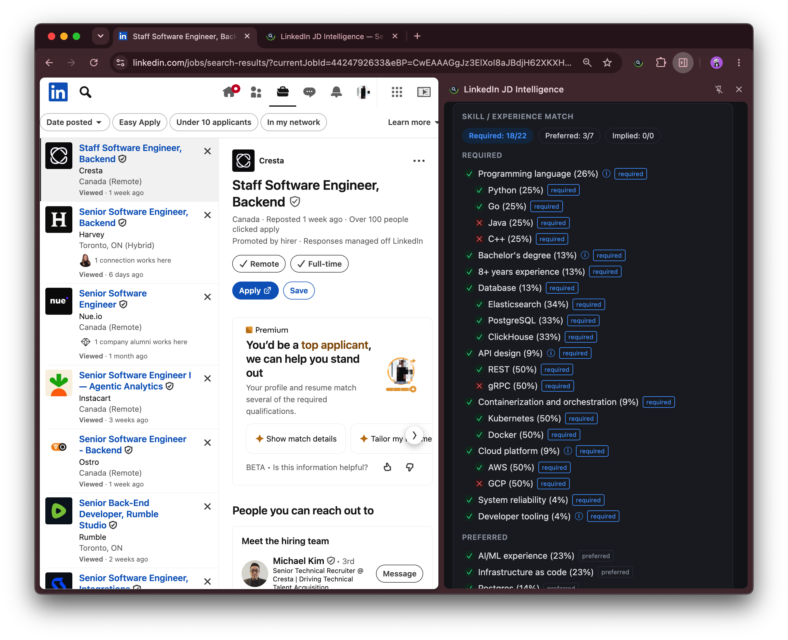

# linkedin-jd-intelligence

> 🤖 This repo is built with AI-assisted coding (Claude Code).

Chrome browser extension: job posting intelligence for LinkedIn and company career sites.

**[Install from the Chrome Web Store](https://chromewebstore.google.com/detail/linkedin-jd-intelligence/cbigdbaklnmnjoehphidondmogiaehne)**

Not affiliated with, endorsed by, or sponsored by LinkedIn Corporation.

## Disclaimer

This is a personal tool for manually initiated analysis. It does not automate scraping,
bulk data collection, or other activity intended to circumvent LinkedIn controls, and it
must be used in accordance with LinkedIn's User Agreement and applicable policies.

Full design (architecture, diagrams, data model, algorithms) lives in
[`docs/DESIGN.md`](docs/DESIGN.md). For a guided tour of the code — the file layout and how a click
on "Analyze" actually flows end to end — see [`src/README.md`](src/README.md).

## Privacy

Your OpenAI API key, resume text, and every job analysis are stored **only in your own browser
profile** (`chrome.storage.local` / IndexedDB). Nothing is ever
sent to, or readable by, any server this extension's developer runs — there is no backend.

The **only** network call it ever makes is a direct request from your browser to OpenAI's API, using
the key you provide, to generate the analysis you explicitly ask for by clicking Analyze. Since
every call is authenticated with your own key, every one of them is traceable in your own OpenAI
account's usage dashboard — nothing routes through, or is logged by, anyone else.

The extension can read visible text from the active HTTP(S) page when the side panel is open. It sends
that page text to OpenAI only after you click Analyze; the model checks whether the page contains a
specific job posting before running resume matching.

```
 Your browser
 ┌──────────────────────────────────────────────────┐
 │ chrome.storage.local / IndexedDB                 │
 │   ▲ read/write only — stays right here           │
 │   │                                              │
 │ Side panel ──"Analyze" click──▶ fetch()          │
 └────────────────────────────────┬─────────────────┘
                                  │  HTTPS, authenticated with YOUR OpenAI API key
                                  ▼
                           api.openai.com
                  (every request is traceable in YOUR OWN OpenAI usage dashboard)
```

Full details, including exactly what's collected and why: [`PRIVACY.md`](PRIVACY.md).

## Build & load

```
npm install
npm run build      # tsc --noEmit && vite build -> extension/
```

Then `chrome://extensions` → Developer mode → "Load unpacked" → select `extension/`.

Or grab a prebuilt zip from the [Releases page](https://github.com/solomonxie/linkedin-jd-intelligence/releases) and load it unpacked after unzipping.

## Screenshots

| Skill / experience match | Settings — resumes, model, block list |
|---|---|
|  |  |


