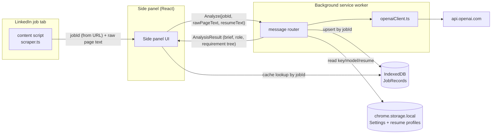
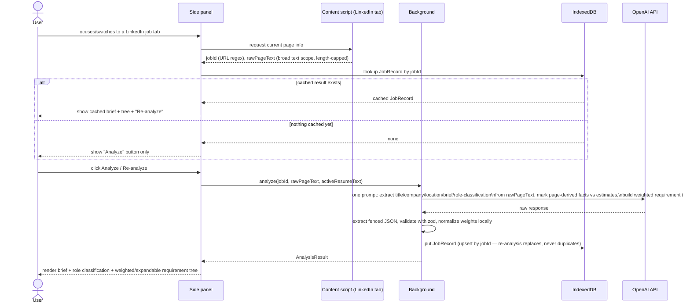

# Design: LinkedIn JD Intelligence

**Status: draft, awaiting confirmation before any implementation code is written.**

## Overview

A Chrome extension (Manifest V3) that, on a LinkedIn job posting, scans the page and uses an LLM (OpenAI API) to:

- extract job requirements as a **weighted, expandable hierarchy** (main skills with nested sub-skills, ordered by importance), including skills a requirement *implies* and not just literal keywords
- compare those requirements against the user's resume and show what's matched vs. missing
- assemble a short **company & role brief** (industry, size, ARR, funding stage, tech stack, salary range, applicant count, senior headcount), pulling whatever's visible on the page and filling gaps from the model's general knowledge — no live web search
- produce a **normalized role classification**, since job titles are often misleading (e.g. "Software Engineer, Data Platform" is really a Data Engineering role)
- show a **regional skill-prevalence estimate** per requirement, computed locally from the user's own analyzed-job history

Everything — API key, resumes, job cache — lives entirely on-device. There is no backend server. LLM access is an OpenAI API key only for v1 (tab-automation modes that would drive an open ChatGPT/Gemini tab were considered and dropped as too unstable for now — see Backlog).

## Architecture



No `scripting`/`tabs` permissions and no `chatgpt.com`/`gemini.google.com` host access — the extension only ever talks to `linkedin.com` (content script) and `api.openai.com` (background).

## Analyze flow (manual trigger, per-job caching)



Analysis is **manual-trigger only** — never fired automatically by page load, so browsing listings never silently spends an API call. The side panel is per-window (Chrome's default), not auto-bound to one tab — it listens for `chrome.tabs.onActivated`/`onUpdated` and re-runs the lookup above every time the focused tab changes, so switching between LinkedIn job tabs shows that tab's cached result instead of stale data from the previous one.

### Task durability

The actual OpenAI call happens in the background service worker, not in the side panel's UI thread or the content script — so it is **not** tied to the LinkedIn tab's lifetime. Refreshing or closing that tab, or closing the side panel, does not interrupt an in-flight analysis; reopening the side panel re-reads the record from IndexedDB and picks up wherever it is. Concretely: on Analyze click, the background immediately upserts a `JobRecord` with `status: "pending"` and a `startedAt` timestamp *before* awaiting the API call, then updates it to `"ok"`/`"unparsed"`/`"error"` when the call settles. The side panel renders a spinner for `"pending"` records.

**Hard limit, stated plainly**: this cannot survive a full Chrome quit — an in-flight `fetch()` and any unsaved in-memory state die with the process, and there is deliberately no server-side job queue (that would mean a backend, which is out of scope). The same gap also covers the rarer case of Chrome evicting an idle MV3 service worker mid-request. Mitigation, not a fix: if a `JobRecord` is still `"pending"` and `startedAt` is older than a short staleness threshold (e.g. 2 minutes — well past a normal OpenAI response time), the side panel treats it as abandoned and shows "previous analysis didn't complete — click Analyze to retry" instead of an indefinite spinner.

## Wireframes (ASCII)

Side panel:
```
┌─────────────────────────────────┐
│ LinkedIn JD Intelligence    ⚙   │
├─────────────────────────────────┤
│ Senior Backend Engineer          │
│  → classified as: Data Engineer  │
│ Acme Corp · San Francisco, CA    │
│ Resume: [Backend ▾]              │
│                                   │
│ ▾ Company & Role Brief            │
│  Domain        acme.com     est  │
│  Size          1,001-5,000  page │
│  Eng. size     ~300         est  │
│  ARR           ~$200M       est  │
│  Stage         Public (NYSE) page│
│  Tech stack    Python,Go,K8s est │
│  Salary        $150K-$190K  page │
│  Applicants    87 applicants page│
│  Sr. headcount ~40 sr. eng.  est │
│  (est = LLM's general knowledge, │
│   not verified — may be stale)   │
│                                   │
│         [ Re-analyze ]           │
│                                   │
│ Required   9/10   ▓▓▓▓▓▓▓▓▓░     │
│ Preferred  2/3    ▓▓▓▓▓▓░░░░     │
│ Implied    4/6    ▓▓▓▓▓▓░░░░     │
│ (rows below sorted by weight ↓)  │
│                                   │
│ ▸ Python (42%) ⓘ         ✔ req.  │
│ ▾ Container system (18%) ✔ req.  │
│    ├ Kubernetes (11%) ⓘ  ✘ req.  │
│    ├ Docker (5%)          ✔ impl.│
│    └ Microservices (2%)   ✔ impl.│
│ ▸ Columnar DB (9%) ⓘ      ✔ impl.│
│ ▸ Git (3%)                ✔ nice │
│  ⓘ hover → "~1,240 candidates in │
│    San Francisco, CA likely have │
│    this skill (est. from 8       │
│    postings you've analyzed here;│
│    rough heuristic, not verified)"│
│                                   │
│ [ View job history ]             │
└─────────────────────────────────┘
```

Options page:
```
┌──────────────────────────────────────────┐
│  Settings   │   History                   │
├──────────────────────────────────────────┤
│ OpenAI API key   [ ********************* ]  │
│ Model            [ gpt-4o-mini        ▾ ]   │
│                                              │
│ Resume profiles                             │
│   • Backend  (active)   [rename] [delete]   │
│   • Data                [rename] [delete]   │
│   [ + Upload resume (PDF/DOCX) ]            │
└──────────────────────────────────────────┘
```

## Toolchain

- TypeScript + **Vite** + **`@crxjs/vite-plugin`** + **React** (`@vitejs/plugin-react`) for the side panel and options pages.
- `npm`, local `node_modules` only (gitignored), no global installs.
- Libraries: `pdfjs-dist` (PDF text extraction, worker bundled locally — never CDN), `mammoth` (DOCX → text), `zod` (LLM-response schema validation), `idb` (IndexedDB wrapper), `vitest` (unit tests, jsdom env).

## Manifest (MV3)

```jsonc
{
  "permissions": ["storage", "unlimitedStorage", "sidePanel"],
  "host_permissions": ["https://www.linkedin.com/*", "https://api.openai.com/*"],
  "background": { "service_worker": "src/background/index.ts", "type": "module" },
  "side_panel": { "default_path": "src/sidepanel/index.html" },
  "options_ui": { "page": "src/options/index.html", "open_in_tab": true },
  "content_scripts": [{ "matches": ["https://www.linkedin.com/jobs/*"], "js": ["src/content-scripts/linkedin/index.ts"], "run_at": "document_idle" }]
}
```

## File layout

```
src/
  background/
    index.ts                 # service worker, message router
    llm/
      openaiClient.ts         # fetch() to api.openai.com
      promptBuilder.ts         # pure: (resumeText, rawPageText) -> prompt
      responseParser.ts        # pure: raw text -> AnalysisResult | ParseError
    historyStore.ts            # upserts JobRecord into IndexedDB
  content-scripts/
    linkedin/
      scraper.ts               # jobId (URL regex), raw page text (main-landmark → body fallback, length-capped), SPA nav watch
      index.ts                 # entry: scrape + message background/side panel only
  options/                     # React: Settings (key, model, resume profiles) + History, one page
  sidepanel/                   # React: persistent per-job UI, cache-aware, brief + requirement tree
  shared/
    types.ts                   # JobRecord, AnalysisResult, RequirementNode, CompanyInfo, RoleInfo, Fact<T>, Settings, ResumeProfile
    storage.ts                 # typed chrome.storage.local wrapper
    db.ts                      # idb wrapper for job history
    resumeParser/{pdfParser,docxParser,index}.ts
    matchFacts.ts               # pure: RequirementNode[] -> per-tier {matched, total} (top-level nodes only) + local weight normalization
    roleTaxonomy.ts             # suggested normalized-role labels, used by promptBuilder
    skillPrevalence.ts          # pure: JobRecord[] + regionBucket -> Map<skill, estimatedCandidateCount>
    messaging.ts                # typed message envelope
```

## Key mechanics

### LinkedIn scraping (`scraper.ts`)

No per-field selectors beyond two robust, low-risk ones. Job ID comes from a regex on the URL (`/jobs/view/{id}` or the `currentJobId` query param) — a URL pattern is far more stable than any DOM selector. Everything else is one broad text grab: `document.querySelector('main')?.innerText ?? document.body.innerText`, truncated to a bounded length (e.g. ~20,000 characters) to keep token cost predictable on LinkedIn's often-long pages (related-jobs rails, feed suggestions, etc.). This raw text is handed to the LLM wholesale — the LLM does *all* field extraction (title, company, location, description, applicant count if present, salary if present, company-card info if present), not the content script. A `MutationObserver` + URL-change watch re-triggers extraction on LinkedIn's SPA navigation; if the URL doesn't match a job-view pattern at all, the side panel shows "not a job page" without bothering to call the LLM.

This trades a bit of extraction precision for resilience: the extension only breaks if LinkedIn removes the page's text content entirely, not if it renames a CSS class.

### Prompt/response contract

One prompt, one fenced JSON block, built from `{ resumeText, rawPageText }`:

```
{
  jobTitle: string, company: string, location: string,
  workplaceType: "remote"|"hybrid"|"onsite"|null,
  companyInfo: {
    industry: Fact<string[]>, mainProducts: Fact<string[]>,
    employeeSize: Fact<string>, engineeringSize: Fact<string>,
    arr: Fact<string>, fundingStage: Fact<string>,
    ownership: Fact<"public"|"private">, techStack: Fact<string[]>
  } | null,   // null when already cached — see "Company info cache" below
  role: { salaryRange: Fact<string>, seniorHeadcount: Fact<string>, applicantCount: Fact<number> },
  roleClassification: { normalizedRole: string, rationale: string },
  requirements: RequirementNode[],
  interviewRounds: InterviewRound[],
  summary: string
}
// Fact<T> = { value: T | null, source: "page" | "llm-estimate" | "user" }  ("user" only ever set by a
//   manual edit in the side panel — see "Manual edits" below, never written by the LLM)
// RequirementNode = { requirement: string, tier: "must-have"|"nice-to-have"|"implied",
//                      weight: number, matched: boolean, evidence: string|null,
//                      resumeSnippet: string|null, children: RequirementNode[] }
// InterviewRound = { label: string, durationMinutes: number|null, mode: string|null, source: "page"|"user" }
```

`source: "page"` means the model found that fact literally in `rawPageText` (it must not invent or contradict what's actually on the page); `"llm-estimate"` means it filled a gap from general training knowledge, with an explicit instruction to return `value: null` rather than a specific-sounding guess when not reasonably confident — this applies hardest to ARR, funding stage, engineering headcount, senior headcount, and salary-when-not-shown. **`role.applicantCount` is the one field that must never fall back to `"llm-estimate"`** — if the count isn't literally present in the page text, the correct answer is `null`, since there's no reasonable general-knowledge basis for guessing a specific applicant number (unlike ARR or headcount, which have loose public-knowledge anchors).

**Role classification**: asks the model to classify what the role *actually is* from its responsibilities, not the literal title — titles are frequently misleading (e.g. "Software Engineer, Data Platform" describing what is really Data Engineering work). The prompt offers a suggested (not enforced) taxonomy from `roleTaxonomy.ts` — Software Engineer (Backend/Frontend/Full-Stack), Data Engineer, Data Scientist, Data Analyst, ML Engineer, MLOps Engineer, DevOps/SRE, Platform/Infrastructure Engineer, Mobile Engineer, QA/Test Engineer, Security Engineer, Engineering Manager — with a free-form fallback plus a one-sentence rationale when none fit well.

**Requirement tree scope**: skills/tools/domain knowledge/experience/certifications only — a resume can provide evidence for or against these. Employment logistics (employment type/schedule, work authorization, security clearance, relocation, on-site/hybrid/remote — the last already captured by `workplaceType` above) and education/degree requirements (bachelor's/master's/PhD, field of study, GPA, and similar) are explicitly excluded from the tree, matched or not — same as soft skills.

**Requirement naming**: `requirement` is a bare skill/tool name only (e.g. "TypeScript", "Docker") — the
prompt explicitly tells the model to strip wrapper phrasing ("Experience with", "Proficiency in") and to
split a bullet naming multiple skills ("Experience with TypeScript and Golang") into separate sibling
nodes, never one combined node.

**Requirement tree, weight, and implication**: extraction instructions ask the model to build a weighted hierarchy, not a flat list — group related sub-skills under a main skill/category (Django/FastAPI under Python; Kubernetes/Docker under Container system; ClickHouse/Parquet under Columnar DB) as `children`, and assign each node (at every depth) a `weight` (0–100) reflecting how central it is to the role, roughly comparable across siblings. `background/llm/skillPresets.ts` is a curated, categorized reference of common technical skills and what they imply (Languages, Backend frameworks, Databases, Cloud, DevOps, etc.), formatted compactly and injected into the prompt as grounding — not exhaustive, the model still uses judgment beyond it. Implication runs both directions: a concrete tool implies broader underlying skills (Django → Python/ORM/REST APIs; Spark → distributed data processing), and a generic/abstract JD phrase implies the concrete tools commonly used for it ("containerization and orchestration experience" → Docker, Kubernetes; "infrastructure as code" → Terraform, Ansible) — the posting's own phrase stays as the node name in that case, with the concrete tools added as `tier: "implied"` children. Soft skills (communication, collaboration, leadership, etc.) are explicitly excluded, same as employment logistics.

**Matching reasons about implication too**: a node counts as `matched` if the resume shows explicit **or** implied evidence (e.g. "Python" matches, with evidence noting the inference, if the resume only lists "Django") — one reasoning pass, at every node in the tree.

`matchFacts.ts` derives "n/m" locally per tier by counting **every node in the tree, at every depth** — `implied` only ever appears as a nested child by construction (see above), so a top-level-only count would always read 0/0 for it. `must-have` matched/total is primary, `nice-to-have`/`implied` shown as secondary lines. It also **locally renormalizes `weight` values** at each sibling level so displayed percentages sum to 100 (the model's raw weights are a rough signal, not trusted arithmetic) — the UI sorts each level by this normalized weight, descending.

`responseParser.ts` extracts the fenced JSON (fallback: bare fence, then first-`{`-to-last-`}`), validates with `zod` (recursive `RequirementNode`, `Fact<T>` shape), and on total failure stores the record with `status: 'unparsed'` + raw text. `response_format: {type:"json_object"}` is set on the API call as a belt-and-suspenders layer on top of the same contract.

**Interview rounds**: like `applicantCount`, never `"llm-estimate"` — guessing a specific company's actual
process from general knowledge would be misleading, so a round is only ever extracted when the posting
explicitly describes its hiring process (a numbered list, an "Our process" section, etc.); otherwise
`interviewRounds: []`. The side panel lets the user add rounds by hand when the posting doesn't say
(`source: "user"`) — see "Manual edits" below.

### Manual edits (`CompanyRoleBrief.tsx`, `InterviewRounds.tsx`)

Any `companyInfo`/`role` fact, and interview rounds, can be edited or added by hand in the side panel when
the LLM left them blank or got them wrong — click the ✎ next to a row, or "+ Add field"/"+ Add round" for
one that's currently empty. A hand-entered/edited value is tagged `source: "user"` (a badge reads
"edited") and written straight to the `JobRecord` via `upsertJobRecord`, no LLM call involved.

**Survives re-analysis**: clicking "Re-analyze" re-derives everything from a fresh LLM call, which would
otherwise silently clobber a hand edit — `historyStore.ts`'s `completeAnalysisOk` merges instead of
overwriting: any `companyInfo`/`role` fact whose *existing* stored value has `source: "user"` is kept over
the fresh one, and existing `source: "user"` interview rounds are appended after the freshly-derived ones
rather than dropped.

**Reordering**: interview rounds can be drag-reordered (native HTML5 drag-and-drop on each row); dropping
persists the new array order via `upsertJobRecord`, same path as any other edit.

**Immediate reflection**: an edit calls `upsertJobRecord` then both `broadcastJobRecordUpdated` (for other
open extension pages, e.g. the History panel) and a direct `onSaved` callback into `useActiveJob`'s
`refresh()` — the side panel doesn't rely on receiving its own broadcast (Chrome doesn't reliably deliver
a `runtime.sendMessage` back to the same page that sent it) to see its own edit reflected.

### Export as PDF (`PrintPage.tsx`, `main.tsx`)

A side panel can't reliably `window.print()` (Chrome restricts printing from that surface). "Export as
PDF" instead opens the *same* `sidepanel/index.html` bundle in a normal tab with `?printJobId=<id>` —
`main.tsx` checks for that query param and renders `PrintPage` (a read-only, non-interactive layout of one
`JobRecord` loaded directly from IndexedDB by id, bypassing the active-tab detection `useActiveJob` needs)
instead of `App`, with the requirement tree and brief pre-expanded (no interaction available to expand
them with), then calls `window.print()` once the layout settles — a normal tab prints fine, so the
browser's native "Save as PDF" destination in that dialog is the actual PDF output.

### Block list (`shared/blockList.ts`, `shared/storage.ts`)

The side panel footer has "Block this job"/"Block this company" links; the Options Settings page has a
"Blocked companies & jobs" list (with per-entry Unblock) plus two free-form keyword lists — company-name
keywords and role-title keywords, each matched as a case-insensitive substring. All four lists live on the
`Settings` singleton (`blockedJobs`, `blockedCompanies`, `companyBlockKeywords`, `roleBlockKeywords`), not
`JobRecord`/IndexedDB — blocking hides a job from analysis, it never deletes history.

`checkBlocked()` (pure, `shared/blockList.ts`) runs in the side panel before both the auto-analyze effect
and the manual Analyze button render, in priority order: exact job id, then exact company (keyed like the
company-info cache, see below), then a company-name keyword, then a role-title keyword. A match renders a
blocked screen (reason + Unblock, or a pointer to Settings for a keyword match) instead of the normal
panel, and skips auto-analyze — the point is to never spend an API call on a job the user has already
ruled out.

**Pre-analysis coverage**: company/title are only known *exactly* from a completed analysis — same
chicken-and-egg problem the company-info cache hits. `checkBlocked()` reuses that cache's URL-slug hint
(`extractCompanySlugHint`) plus a new `extractTitleSlugHint` (same regex family, captures the slug before
`-at-` instead of after), humanized by turning dashes into spaces, as a best-effort pre-analysis guess so a
keyword block can apply *before* the first analysis, not just on a revisit. A miss just means the block
can't apply until the job is analyzed once — never a wrong block.

### Company info cache (`shared/companyKey.ts`, `shared/db.ts` "companies" store)

`companyInfo` rarely changes job-to-job for the same company, so it's persisted separately from
`JobRecord`s and reused instead of re-derived by the LLM every time:

- **Key**: `normalizeCompanyKey()` lowercases, strips common corporate suffixes (Inc/LLC/Corp/...), and
  strips remaining punctuation — "Affirm, Inc." and "Affirm" both key to `"affirm"`.
- **Pre-call lookup (the actual cost saving)**: `company` is otherwise only known *from* the LLM's own
  response — a chicken-and-egg problem for skipping that response's own tokens. `extractCompanySlugHint()`
  breaks the loop with a best-effort guess from LinkedIn's SEO-slugged job URL
  (`.../{title-slug}-at-{company-slug}-{id}/`); a match is looked up in the cache *before* the prompt is
  built. On a hit, the prompt tells the model companyInfo is already known and to return
  `"companyInfo": null` instead of re-deriving it — real token savings, since the caller fills the field
  back in from the cache before the record is stored. A miss (unslugged URL, or no cache entry yet) just
  falls back to asking the LLM as normal — never wrong, only sometimes skips the saving.
- **Write-back**: whenever companyInfo *is* freshly derived, it's upserted under both the name-derived key
  and the URL-slug key (when they differ) so a future lookup by either route hits.
- **No expiry**: persisted indefinitely in its own store, not a TTL cache — company facts drift slowly
  enough that re-analyzing a job at a company is the natural way to refresh it.

### Skill prevalence estimate (`skillPrevalence.ts`, pure, computed on read, no LLM call)

For each **top-level** requirement row the side panel shows an "ⓘ" with an estimated number of regional candidates who plausibly have that skill, derived **only from the user's own cached job history** — no external data, no web search.

- **Region bucketing**: `regionBucket` is the scraped `location` text (trimmed/case-normalized) as extracted by the LLM from `rawPageText`, or `"Remote — <country/region as shown>"` for remote listings — no geocoding, just grouping by whatever LinkedIn's own location text says.
- **Modeling assumption** (stated explicitly in the tooltip copy, not hidden): the same pool of candidates in a region evaluates every job posting the user has analyzed there, and a person applies to a job iff they have *all* of its top-level `must-have` skills — i.e. applicant count is treated as "how many pool members are a full must-have match." Skills are treated as independent for tractability (a known simplification — correlated skills like Python+Django will skew estimates somewhat, called out as a limitation).
- **Algorithm**: within one `regionBucket`, gather every cached `JobRecord` that has both a non-null, non-zero `applicantCount` (`log(0)` is undefined) and a non-empty top-level `must-have` node set, with names normalized (lowercase/trim). Fit a small ridge-regularized log-linear model — unknowns are `logP` (log of the regional candidate-pool size) and `log_q[s]` per distinct skill `s`; each job contributes one equation `log(applicantCount) ≈ logP + Σ_{s ∈ mustHaveSkills} log_q[s]`. Solve by gradient descent (a plain, dependency-free routine — small enough problem size for personal browsing history that no numerics library is needed), with L2 regularization on `log_q[s]` toward 0 so the system stays well-behaved when underdetermined. Estimated candidate count for skill `s` is `round(exp(logP + log_q[s]))`, clipped to a sane range (never below the largest single observed applicant count among jobs requiring `s`).
- **Minimum data guard**: below a small threshold of qualifying jobs in a region (e.g. 4), the tooltip reads "not enough data yet in this region" instead of showing a number.
- **Worked example**: job A needs Python+Go, 400 applicants; job B needs Python+C#, 200 applicants — the overlap in required-skill sets (shared "Python") across jobs is exactly the signal the regression uses to separate out each individual skill's contribution instead of just reporting raw per-job totals.

### Storage

`chrome.storage.local` for the `Settings` singleton — `{ openaiApiKey, openaiModel, activeResumeProfileId, resumeProfiles: ResumeProfile[] }`, `ResumeProfile = { id, name, fileName, parsedAt, text }` (multiple named resumes, one active). Not encrypted beyond normal browser-profile sandboxing — noted in the Options UI copy.

`IndexedDB` via `idb` for `JobRecord` (keyed by LinkedIn job id — upsert, so re-analysis replaces rather than duplicates), storing the requirement tree, the company/role brief, `roleClassification`, `regionBucket`, `status`, and `resumeProfileId` used, indexed by `analyzedAt`/`resumeProfileId`/`regionBucket` (the last one is what `skillPrevalence.ts` queries against). A separate `companies` store (keyed by `normalizeCompanyKey()`) holds `CompanyRecord { key, name, companyInfo, updatedAt }` — see "Company info cache" above.

**Export**: the Options History panel's "Export all data" button downloads every `JobRecord` and every `CompanyRecord` (not just what's currently filtered in the table) as one JSON file — a full local backup of both IndexedDB stores. `Settings` (including the API key) is deliberately not included.

### Robustness

Analyze button disables while a request is in flight. If PDF/DOCX parsing yields little/no text (e.g. scanned/image-only PDF), the upload flow warns instead of silently saving an empty profile. A missing/invalid API key or a network failure surfaces a visible, specific error in the side panel. If `rawPageText` extraction yields implausibly little text (page not fully loaded, or an unrecognized layout), the side panel shows "couldn't read this page yet" with a manual retry rather than sending a near-empty prompt.

## Backlog (not building now — defer until explicitly requested)

- **Tab-automation LLM modes** (ChatGPT-tab, Gemini-tab): dropped for instability/ToS-gray reasons; revisit only if OpenAI-key-only proves too limiting.
- **Per-skill match-rate stats**: aggregate across all `JobRecord`s to show, per skill, how often it's required vs. matched over time. History/caching (the data this would read) is in scope now; the aggregation view is not.
- **Chrome Web Store publishing readiness**: privacy-policy page, written permission justifications. Deferred — current focus is local/unpacked use only.
- Synonym-aware skill grouping (e.g. "React" vs "React.js").

## Verification plan

1. `npm run build` → load `dist/` unpacked via `chrome://extensions` (Developer mode).
2. Set a real OpenAI key in Options, open a LinkedIn job, click Analyze in the side panel, confirm a network call to `api.openai.com`, confirm the brief (page-sourced vs. `est`-flagged fields), role classification, and the weighted/expandable requirement tree render, confirm a `JobRecord` is upserted (check via the extension's Application/Storage DevTools panel).
3. Caching: analyze a job, switch to a different LinkedIn tab and back, confirm the cached result reloads without a new API call; click Re-analyze and confirm it replaces (not duplicates) the record.
4. Durability: click Analyze, then immediately refresh the LinkedIn tab (and separately, close the side panel) before it completes — confirm the analysis still finishes and the result is there when you reopen the panel. Kill Chrome entirely mid-analysis, relaunch, reopen the side panel — confirm it does not hang forever, and instead shows the "didn't complete, retry" state once the staleness threshold passes.
5. Brief accuracy spot-check: open a job at a well-known public company and confirm plausible `llm-estimate` values with correct `est` tagging; open one at an obscure/small company and confirm uncertain fields come back `null` rather than a fabricated-looking number; confirm `applicantCount` is `null` whenever the listing doesn't show one (never an estimated guess).
6. Resume profiles: upload a PDF and a DOCX as separate named profiles, switch active profile, confirm Analyze uses the active one.
7. Role classification: open a job with a misleading title (e.g. a "Software Engineer, Data Platform"-style posting) and confirm `roleClassification.normalizedRole` reflects the actual function with a sensible one-sentence rationale.
8. Requirement tree: confirm top-level rows render sorted by (locally renormalized) weight descending and sum to ~100%; confirm a multi-skill category (e.g. "Container system") expands to its children on click and collapses again; confirm the headline "n/m" figures count top-level nodes only.
9. Skill prevalence: with fewer than the minimum qualifying jobs analyzed in a region, confirm the tooltip shows "not enough data yet"; after analyzing enough jobs with overlapping must-have skills and applicant counts in one region, confirm each skill's tooltip shows a distinct, plausible estimate.
10. Scraping resilience: confirm analysis still works if LinkedIn's markup changes cosmetically (class-name renames) since nothing depends on per-field selectors beyond the URL-based job ID.
11. Unit tests (Vitest, jsdom): `promptBuilder`, `responseParser`, `matchFacts` (tree flattening, top-level-only counting, weight renormalization), `skillPrevalence` (minimum-data guard, synthetic Python/Go/C# example), `resumeParser` dispatch logic.
